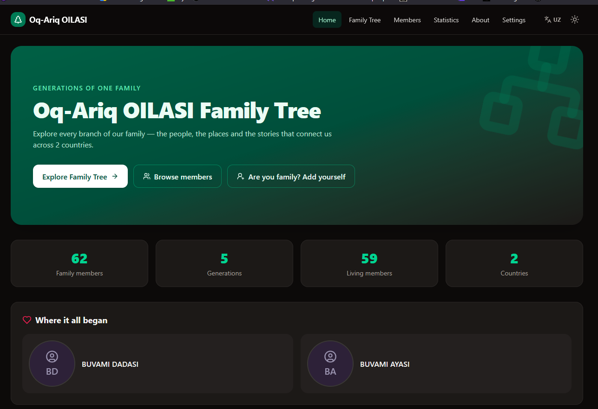
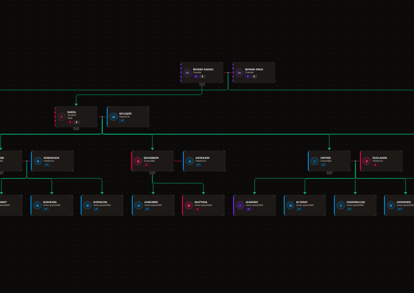
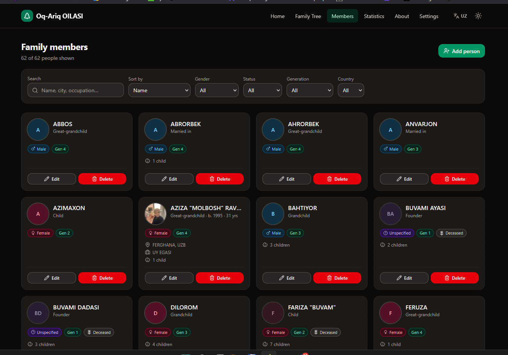

https://imgur.com/a/5cWEiLi

# Oq-Ariq OILASI — Family Tree

**Created and maintained by Kadir Ravshanov.**

An interactive family tree website for the Oq-Ariq family, built with React,
TypeScript, Vite, Tailwind CSS and React Flow. Family data is shared through a
free Supabase database, so an edit made by the owner is visible to every
visitor on every device.

**Live site:** https://myfamilytree-kdr6.vercel.app
(mirror: https://kdrcoding.github.io/myfamilytree/)

Both addresses are permanent — redeploying the site never changes them, so
links shared with family members always keep working.

## How the website works

The site has two halves:

1. **The website itself** (what you see) is a static app. It is built once and
   served by Vercel and GitHub Pages. It contains no family data of its own.
2. **The family data** (people, relationships, photos) lives in one shared
   [Supabase](https://supabase.com) database in the cloud. When anyone opens
   the site, their browser loads the family straight from that database — so
   everyone always sees the same, current tree.

What happens when you edit:

- You sign in on the website with the **owner password** (or a relative uses
  the **member password**, which can only fill in missing information — it can
  never delete or overwrite anything).
- Every add / edit / delete is saved to the shared database **immediately**.
  There is nothing to export, rebuild or redeploy — refreshing on any other
  phone or computer shows the change right away.
- Each visitor's browser only remembers personal preferences (language, theme,
  privacy switches) — never the family data itself.

Redeploying (`tools\deploy.bat`) is only needed when the **code or design** of
the website changes, not when family information changes.

## Screenshots

**Home** — family overview with live statistics:



**Family Tree** — interactive tree with marriage and descent lines:



**Members** — searchable, filterable cards for everyone in the family:



## Features

- **Interactive tree** — pan, zoom, fit-to-screen, minimap, smooth animations. Spouses sit side by side with a marriage line; children hang from a connector under each couple. Branches expand/collapse with a hidden-relatives counter. Handles 200+ people comfortably.
- **Person cards & details** — photo or generated initials avatar, name, nickname, gender indicators (icon + text + color, never color alone), birth/death dates, auto-calculated age, city, country, occupation, biography, relationship label, generation number, deceased styling.
- **Editing with roles** — password-protected edit mode with two roles:
  - **Owner**: add, edit anything, delete, change relationships, import/replace, reset.
  - **Family editor (member password)**: can add people and **fill in missing info** on existing people — but can never delete anyone, overwrite or clear existing details, change names, change relationships, or replace/reset the data. Share this password with relatives.
- **Flexible names** — only one of first name / last name / nickname is required, so you can add relatives whose full name you don't know yet.
- **Full relationship editing** — add a spouse, child, parent or sibling from any person's card. Relationships stay synchronized in both directions, and impossible ones (self-parent, ancestor cycles, marrying your own parent, more than two parents) are rejected.
- **Search & filters** — find anyone by name, nickname, city, country or occupation; selecting a result expands their branch, centers and highlights them. Filter by gender, living/deceased, generation and country.
- **Statistics** — live dashboard: totals, generations, gender split, countries, cities, oldest/youngest living, average age, most children, most descendants, CSS bar charts.
- **"Add yourself"** — visitors can add themselves without any password: they pick who they're related to, fill in their card, and a small **join-request file downloads automatically** for them to send to the owner. The owner imports it and the person is **merged** into the tree (nothing else is touched).
- **Import / export** — JSON export (backup), validated JSON import with confirmation, join-request merging, PNG image export of the visible tree, reset to sample data.
- **One-click Windows scripts** — `tools\start.bat` runs the site locally, `tools\deploy.bat` builds and deploys (Vercel or GitHub) with a double-click.
- **Privacy mode** — switches to hide exact dates, minors' ages, cities, occupations, biographies and photos before you share the site publicly.
- **Polished UI** — light/dark theme, responsive layout, keyboard-accessible controls, focus states, toasts, confirmation dialogs, error boundary.
- **Persistence** — family data lives in a shared Supabase database (free tier): every edit is saved there and visible to all visitors. Theme, language, privacy switches and collapsed branches stay per-browser in LocalStorage.

## Quick tour — how to use the site

1. **Home** — overview, stats, and the "Explore Family Tree" button.
2. **Family Tree** — the main view. Drag to pan, scroll/pinch to zoom, use the controls (bottom right) to zoom or fit everything on screen. Click any card for full details; click the small chevron under a parent to collapse/expand that branch. Search (top left) finds anyone and jumps to them; the filter dropdowns dim everyone who doesn't match.
3. **Edit mode** (Family Tree page, top right) — enter a password to unlock. Small round buttons then appear on every card: **♥ adds a spouse**, **👶 adds a child**, and **+ adds a parent** (on people with no parents yet). One click opens a short form — just a name and gender; everything else lives under "More details (optional)". Use **Save & add another** to enter several children in a row (last name, city and country carry over). You can also open a card for the full **Add spouse / child / parent / sibling**, **Edit** and **Delete** (owner only) actions. The padlock/sign-out icon locks editing again.
4. **Members** — everyone as searchable, sortable cards with edit/delete shortcuts.
5. **Statistics** — live counts and charts; updates instantly when data changes.
6. **Settings** — theme, privacy mode, passwords, and backup (export / import / reset).
7. **Backups** — click **Export** on the Tree page any time; it downloads a JSON file that can restore everything via **Import**.

## Technology stack

| Layer      | Choice                                        |
| ---------- | --------------------------------------------- |
| Framework  | React 19 + TypeScript (strict)                |
| Build      | Vite 7                                        |
| Styling    | Tailwind CSS 4                                |
| Tree       | React Flow (`@xyflow/react`) + custom layout  |
| Icons      | Lucide React                                  |
| PNG export | `html-to-image`                               |
| Storage    | Supabase (free tier) for family data; LocalStorage for UI preferences |

## Installation

Requires Node.js 20.19+ (22 recommended).

```bash
git clone https://github.com/YOUR_USERNAME/YOUR_REPOSITORY.git
cd YOUR_REPOSITORY
npm install
```

## Shared data with Supabase

Family data is stored in a shared [Supabase](https://supabase.com) database (free
tier), so an edit made by the owner is immediately visible to **every visitor on
every device**. LocalStorage is only used for per-browser preferences (theme,
language, privacy switches, collapsed branches) and the remembered password.

### 1. Create the Supabase project

1. Sign up at [supabase.com](https://supabase.com) (free) and click **New project**.
2. Pick any name/region, set a strong database password (you won't need it in the app), and wait for the project to be created.

### 2. Run the SQL migrations

1. In the Supabase dashboard open **SQL Editor → New query**.
2. Paste the contents of [`supabase/migrations/20260713000001_init.sql`](supabase/migrations/20260713000001_init.sql) and click **Run**.
3. Do the same with [`supabase/migrations/20260713000002_policies.sql`](supabase/migrations/20260713000002_policies.sql).

(If you use the Supabase CLI instead: `supabase link` then `supabase db push`.)

### 3. Configure the environment variables

1. In the dashboard open **Project Settings → API** and copy the **Project URL** and the **anon public** key.
2. Copy `.env.example` to `.env` and fill both values in:

   ```bash
   VITE_SUPABASE_URL=https://YOUR-PROJECT-REF.supabase.co
   VITE_SUPABASE_ANON_KEY=YOUR-ANON-PUBLIC-KEY
   ```

`.env` is git-ignored — **never commit real keys**. The anon key is public by
design (it ends up in the browser bundle); table access is controlled by the
RLS policies from step 2. Never use the `service_role` key in this app.

### 4. Seed the family data (explicit, one time)

The database starts empty and the app never fills it automatically. Choose one:

- **Restore the bundled dataset:** open the site, sign in with the owner
  password, go to **Settings → Restore sample data**.
- **Import your own export:** Tree page → **Import** and pick a JSON export
  (e.g. from the previous LocalStorage version of this site — export it there
  first via Tree → Export).

### 5. Vercel (and other hosts)

Set the same two environment variables wherever the site is built:

- **Vercel:** Project → **Settings → Environment Variables** → add
  `VITE_SUPABASE_URL` and `VITE_SUPABASE_ANON_KEY` (Production, and Preview if
  you use previews) → **Redeploy**.
- **GitHub Pages:** repository **Settings → Secrets and variables → Actions →
  Variables** — add both, then pass them in the build step of
  `.github/workflows/deploy.yml` if you deploy there.
- **Local one-click deploy (`tools\deploy.bat`):** works as-is; the local
  `.env` file is picked up by the build.

Without these variables the site shows a "Database is not configured" screen
instead of silently falling back to sample data.

## Running locally

```bash
npm run dev        # start dev server at http://localhost:5173
```

Other scripts:

```bash
npm run build      # type-check + production build into dist/
npm run preview    # serve the production build locally
npm run lint       # ESLint
npm run typecheck  # TypeScript only
npm run format     # Prettier
```

## Editing the family data

### In the app (recommended)

1. Open the **Family Tree** page and click **Edit mode**.
2. Enter a password (see below), then add or edit people. Click any card → **Add spouse / child / parent / sibling**, **Edit**, or (owner only) **Delete**.
3. Changes save automatically to your browser. Use **Export** to download a JSON backup.

### Blended families & second marriages

Someone married twice (or more) with children from each marriage is fully supported — this is how you record, say, a mother with kids from two husbands:

1. **Add both partners**: open her card → **Add spouse** for the first partner, then **Add spouse** again for the second. (There is no limit; former and current partners are both listed as partners.)
2. **Add each child to the right couple**: open her card → **Add child**. Because she has more than one partner, the form shows an **"Other parent"** dropdown — pick which partner is this child's other parent (or "No second parent / not listed"). The child then appears under the correct couple.
3. **Fixing an existing child**: edit the child → **Parents** picker → tick the correct two parents.

How it looks in the tree:

- The twice-married person stands **in the middle**, with one partner on their **left** and the other on their **right**.
- Each couple has its own **marriage line** and its own **connector dot**, and each child hangs from their own parents' dot — so you can always see which side of the family a child belongs to. Children of the same couple are kept together, so lines never cross.
- Unmarried co-parents (they share a child but aren't listed as partners) are drawn with a **dashed** line instead of a solid one.
- The person's details panel groups children by partner: _"Children with Daniel"_, _"Children with Marcus"_.

The sample family includes a live example: **Emily Hartley** (generation 3) — daughter Lily from her first marriage to Daniel Foster, son Theo from her second marriage to Marcus Webb. Open the Family Tree page and find Emily to see exactly how it renders, then mirror that for your own family.

> Half-siblings are handled automatically: Lily and Theo both show as Emily's children, and each also shows under their own father. "Add sibling" gives the new person the _same two parents_ as the selected person — for a half-sibling, use "Add child" on the shared parent instead and pick the right other parent.

### Letting relatives add themselves (no password)

Anyone visiting the site can click **"Are you family? Add yourself"** (Home page) or **"Add yourself"** (Family Tree page):

1. They choose how they're related — _child / spouse / sibling / parent of_ an existing person (with an "I'm not sure" option), then fill in their own card.
2. They immediately appear on the tree **in their own browser**, and a small file like `join-request-jane-doe.json` downloads automatically.
3. They send that file to you (WhatsApp, email, anything).
4. You open **Import** on the Tree or Settings page and select their file. The app recognizes it as a join request and shows _"Add Jane Doe to the family?"_ with the connection spelled out — confirming **adds just that one person**, without replacing anything. Duplicate ids are renamed automatically, and any relationship data inside the file is ignored except the declared connection (so a request file can never rewrite your tree).

To make the addition permanent for all visitors, republish the site with the updated data (export → paste into `src/data/sampleFamily.ts` → deploy, or just keep your own browser as the source of truth and export backups).

### Passwords — stored locally, never deployed

The actual passwords are written down in the **`password/passwords.txt`** file on your computer. That folder is excluded from git (`.gitignore`) and from Vercel uploads (`.vercelignore`), so **it never reaches GitHub or the live site** — the site only ships one-way SHA-256 hashes in `src/config/access.ts`, which cannot be reversed into the passwords.

| Role                   | Where to find it         | Can do                                                                                                                                                         |
| ---------------------- | ------------------------ | -------------------------------------------------------------------------------------------------------------------------------------------------------------- |
| Owner (you)            | `password/passwords.txt` | add, edit anything, **delete**, change relationships, import/replace, reset                                                                                    |
| Family editor / member | `password/passwords.txt` | add people; fill in **missing** info on existing people. Cannot delete, overwrite existing details, rename anyone, change relationships, or replace/reset data |

When a family editor edits someone, fields that already contain information are locked (greyed out) — they can only complete what's empty. This is enforced in the data layer too, not just the form.

To change a password: **Settings → Editing access → How to change the passwords** → type the new password → **Generate hash** → paste the hash into `src/config/access.ts` → update `password/passwords.txt` for your own records → redeploy.

### Adding someone when you don't know their full name

Only **one** of _first name_, _last name_ or _nickname_ is required. Everything else — including the other name fields — can stay empty and be filled in later. A person entered with just a nickname shows that nickname everywhere (cards, tree, search) until you learn their real name.

**Honest limitation:** this is a static site with no server, so the password is a strong deterrent against casual or accidental changes — not real authentication. A technically skilled visitor could bypass it. Don't rely on it to protect genuinely sensitive data (and don't put such data in the tree at all).

### Collaborating with family (important!)

Each visitor's edits are stored **in their own browser only**. To merge a relative's additions into the published site:

1. They make their edits, then click **Export** and send you the JSON file.
2. You (owner) click **Import**, review, and confirm.
3. Optionally commit the new data as the site default (see below) and redeploy.

### In code

Replace the sample family in **`src/data/sampleFamily.ts`** — this is the data every new visitor sees by default. Each person looks like:

```ts
{
  id: 'jane-doe',            // unique, lowercase, stable
  firstName: 'Jane',
  lastName: 'Doe',
  gender: 'female',           // 'male' | 'female' | 'unspecified'
  birthDate: '1980-05-01',    // 'YYYY', 'YYYY-MM' or 'YYYY-MM-DD'
  isDeceased: false,
  parentIds: ['dad-id', 'mum-id'],
  spouseIds: ['john-doe'],
  childIds: ['kid-id'],
  // optional: nickname, deathDate, photo, city, country, occupation, biography
}
```

Keep relationships symmetric (if A lists B as spouse, B lists A). The app repairs asymmetries on import. Tip: build the tree in the app, export the JSON, and paste the `people` array into `sampleFamily.ts`.

## Import / export JSON

- **Export**: Tree page → **Export**, or Settings → **Export backup**. Produces `family-tree-YYYY-MM-DD.json` with a `version` field for future migrations.
- **Import**: Tree page → **Import** (requires editor/owner). Invalid files are rejected with a clear message; valid files show a confirmation before replacing anything.
- **PNG**: Tree page → **PNG** downloads the current tree as an image.
- **Reset**: Settings → **Reset to sample data** (owner only, with confirmation).

## Publishing YOUR family to the website

Everything you add in the browser is saved **only in that browser**. To make your family the data that everyone sees on the deployed site:

1. In the browser where your family is (the live site or localhost), open **Family Tree → Export**. A `family-tree-YYYY-MM-DD.json` file lands in Downloads.
2. Double-click **`tools\use-my-data.bat`**. It finds your newest export automatically (or drag the file onto the script), makes it the website's built-in data (`src/data/defaultFamily.json`), keeps a backup of the previous data in `password\data-backups`, and offers to deploy right away.
3. Done — every **new** visitor now sees your family. Anyone who visited **before** gets a banner: _"The family tree on this website has been updated — Load latest data / Keep my version."_

"Restore website data" on the Settings page also restores this published data.

## One-click scripts (Windows)

The `tools` folder contains two double-clickable scripts:

- **`tools\start.bat`** — installs dependencies if needed, starts the local site and opens it in your browser. Close the window to stop it.
- **`tools\deploy.bat`** — checks the code, builds it, then asks where to deploy:
  - **[1] Vercel** — runs `npx vercel --prod`. The first time it walks you through logging in (free account) and confirming the project; after that it's truly one click and prints your live URL.
  - **[2] GitHub** — commits your changes and pushes to GitHub, which triggers the GitHub Pages workflow. If no GitHub remote is configured yet, it prints the exact two commands to set one up.
  - **[3] Build only** — just produces the `dist` folder for manual hosting.

## Pushing to GitHub

```bash
git init
git add .
git commit -m "Initial family tree web app"
git branch -M main
git remote add origin https://github.com/YOUR_USERNAME/YOUR_REPOSITORY.git
git push -u origin main
```

Replace `YOUR_USERNAME` and `YOUR_REPOSITORY` with your GitHub username and repository name.

## Deploying to Vercel

1. Push the repository to GitHub (above).
2. Go to [vercel.com](https://vercel.com) → **Add New → Project** → import your repository.
3. Vercel auto-detects Vite. Confirm:
   - **Build command:** `npm run build`
   - **Output directory:** `dist`
4. Click **Deploy**. Done — `vercel.json` already rewrites all routes to `index.html`, so refreshing `/tree` etc. works.

Every push to `main` redeploys automatically.

## Deploying to GitHub Pages

A workflow is included at `.github/workflows/deploy.yml` (installs deps, lints, type-checks, builds, deploys `dist/`).

1. Push to GitHub.
2. Repository **Settings → Pages → Source: GitHub Actions**.
3. Push to `main` (or run the workflow manually). Your site appears at `https://YOUR_USERNAME.github.io/YOUR_REPOSITORY/`.

**Base path:** the workflow sets `VITE_BASE_PATH=/<repo-name>/` automatically, so renaming the repository needs no config change. For a user site (`username.github.io` repo) edit the workflow and set `VITE_BASE_PATH: '/'`. Deep-link refreshes work via the `404.html` fallback the workflow creates. If you deploy to both Vercel and Pages, they coexist fine — each build gets its own base path.

## Privacy warning

This site is designed for public hosting, so treat it like anything public:

- Turn on **privacy mode** (Settings) before sharing the link beyond family.
- Never add addresses, phone numbers, email addresses, ID numbers or documents.
- Get consent from living relatives before publishing their details or photos.
- The edit password limits casual changes, but the data itself is visible to anyone with the link.

## Troubleshooting

| Problem                             | Fix                                                                                                        |
| ----------------------------------- | ---------------------------------------------------------------------------------------------------------- |
| Blank page on GitHub Pages          | Ensure Pages source is **GitHub Actions** and the workflow ran; check the base path note above.            |
| 404 on refresh                      | Vercel: `vercel.json` must be deployed. Pages: the workflow's `404.html` step must run.                    |
| Changes disappeared                 | Edits live in the browser that made them. Restore from a JSON export; export backups regularly.            |
| "Import failed"                     | The file must be a JSON export from this app (or match its schema). The error message lists what's wrong.  |
| Forgot a password                   | Generate a new hash (Settings → Editing access) and replace it in `src/config/access.ts`, then redeploy.   |
| Tree looks tangled after many edits | Impossible links are blocked, but double-check parent assignments on the people involved (Edit → Parents). |
| "Database is not configured" screen | Set `VITE_SUPABASE_URL` / `VITE_SUPABASE_ANON_KEY` (locally in `.env`, on Vercel in Project Settings → Environment Variables) and rebuild.  |
| "Could not load the family data"    | Supabase is unreachable or the tables are missing — re-run the SQL in `supabase/migrations/` and check the project is not paused.           |

## Future improvements

- PDF export (extension point: `src/features/tree/exportPng.ts` — swap `toPng` for a PDF pipeline).
- Timeline view and anniversaries.
- GEDCOM import/export for genealogy software interoperability.
- Photo galleries per person.

## Author

This project was created and is maintained by **Kadir Ravshanov**.

## License & Legal

Copyright © 2026 **Kadir Ravshanov**. All rights reserved. See [LICENSE](LICENSE).

- The **family information** shown on the website (names, dates, photos,
  biographies and relationships) is personal data of the Oq-Ariq family. It
  may not be copied, scraped, republished, sold or used for any purpose
  without the written permission of Kadir Ravshanov.
- The **source code** is published for transparency and personal reference.
  If you would like to reuse it for your own family website, please ask the
  author for permission first.
- The website and software are provided **"as is"**, without warranty of any
  kind. The author is not liable for any damages arising from their use.
- Takedown requests: if you are a family member and want your information
  changed or removed from the site, contact Kadir Ravshanov and it will be
  handled promptly.
